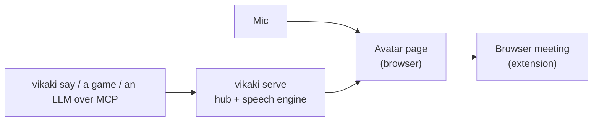

# vikaki

*video + kaki (Malay for "friend")*

A cartoon avatar that talks. Give it a microphone or some text and a friendly 3D (VRM) character lip-syncs, blinks and speaks it, in a browser meeting, on a local page, or driven by an LLM over MCP. Open source, Apache-2.0.

[](docs/media/vikaki-demo.mp4)

*Click for the 15 s demo: type a line, the avatar says it with the real voice (Kokoro), and the timeline shows what was heard.*



More detail: [docs/architecture.md](docs/architecture.md).

## Quick start

Needs Node 24 and pnpm 11 (`corepack enable`).

```bash
pnpm install --frozen-lockfile
make demo          # builds, serves on a free port and opens the demo page
```

On WSL, open the printed `http://127.0.0.1` address in your Windows browser. `make doctor` checks your setup and prints the exact fix for anything missing.

## Use it

**Say something.** `make demo-speech` opens the speech demo: type text, press Speak, and the avatar says it. It installs the real voice first (Kokoro, about 410 MB; `make install-voice` does only that). Without it you get a steady test tone and the page says so. See [docs/tts.md](docs/tts.md).

**Drive it from a terminal.** With `pnpm serve` running and the page open:

```bash
pnpm --silent vikaki say "Good morning everyone, shall we begin?"   # waits until it is spoken; prints time to first audio
pnpm --silent vikaki cancel                                         # stops it mid-sentence, even if another program is driving
```

**Let an LLM drive it.** `vikaki mcp` is an MCP server with `say`, `set_emotion`, `set_persona` and `cancel`:

```bash
claude mcp add vikaki -- pnpm --silent --dir /path/to/vikaki vikaki mcp --port 8787
```

Setup and the tools: [docs/mcp.md](docs/mcp.md). Any program can also speak the WebSocket protocol directly: [docs/protocol.md](docs/protocol.md).

**Be your camera in a meeting.** `make extension` builds a browser extension that replaces your camera in Google Meet with the avatar; its [README](packages/extension/README.md) shows how to load it. Tested against a stand-in page so far, not yet on a real call.

## Status

Early development. Working today: avatar, mic lip sync, speech from text, the CLI, MCP, and a timeline for seeing what was said. Emotions, personas, a headless mode and a video feed are next. Details: [docs/STATUS.md](docs/STATUS.md).

## More

[Plan](docs/PLAN.md), [build order](docs/SLICES.md), [open questions](docs/QUESTIONS.md), [decisions](docs/adr), [testing strategy](docs/testing.md). Contributing: [CONTRIBUTING.md](CONTRIBUTING.md).

## Licence

Apache-2.0. See [LICENSE](LICENSE). Third-party avatars and voices and their licences: [packages/engine/ASSETS.md](packages/engine/ASSETS.md), [docs/tts.md](docs/tts.md).
