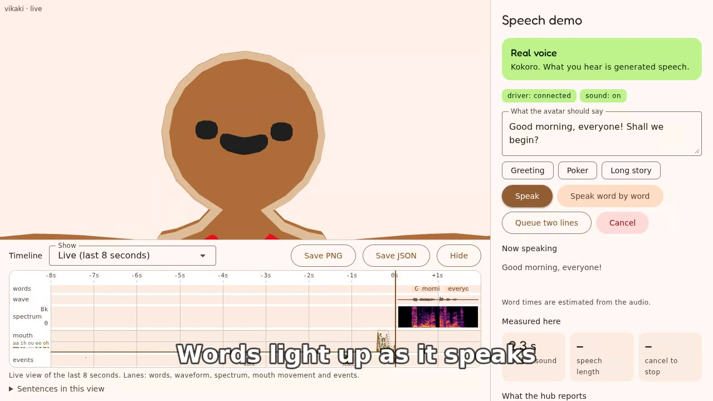
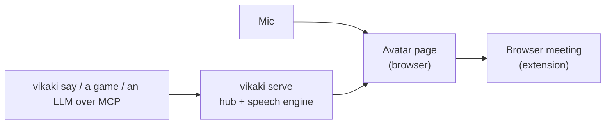

# vikaki

*video + kaki (Malay for "friend")*

A cartoon avatar that talks. Give it a microphone or some text and a friendly 3D (VRM) character lip-syncs, blinks and speaks it, in a browser meeting, on a local page, or driven by an LLM over MCP. Open source, Apache-2.0.

[](docs/media/vikaki-demo.mp4)

*Click for the 15 s demo: type a line, the avatar says it with the real voice (Kokoro), and the timeline shows what was heard.*



More detail: [docs/architecture.md](docs/architecture.md).

## Quick start

Needs Node 24 and pnpm 11 (`corepack enable`).

```bash
pnpm install --frozen-lockfile
make demo          # builds, serves on a free port and opens the demo page
```

On WSL, open the printed `http://127.0.0.1` address in your Windows browser. `make doctor` checks your setup and prints the exact fix for anything missing.

## Use it

**Say something.** `make demo-speech` opens the speech demo: type text, press Speak, and the avatar says it. It installs the real voice first (Kokoro, about 410 MB; `make install-voice` does only that). Without it you get a steady test tone and the page says so. See [docs/tts.md](docs/tts.md).

**Drive it from a terminal.** With `pnpm serve` running and the page open:

```bash
pnpm --silent vikaki say "Oh, you really think so?" --emotion smug --think 1.5   # a moment of thinking, then the line; waits until it is spoken
pnpm --silent vikaki cancel                                                       # stops it mid-sentence, even if another program is driving
```

Seven emotions (`neutral`, `happy`, `smug`, `worried`, `surprised`, `sad`, `angry`) show as a pose plus a small cartoon mark beside the head, and a `turn_started` shows a thinking pose ([ADR-0015](docs/adr/0015-emotions-as-pose-and-manga-symbols.md)).

**Let an LLM drive it.** `vikaki mcp` is an MCP server with `say`, `set_emotion`, `set_persona` and `cancel`:

```bash
claude mcp add vikaki -- pnpm --silent --dir /path/to/vikaki vikaki mcp --port 8787
```

Setup and the tools: [docs/mcp.md](docs/mcp.md). Any program can also speak the WebSocket protocol directly: [docs/protocol.md](docs/protocol.md), and every message and field in [docs/protocol-reference.md](docs/protocol-reference.md).

**Give it a character, or two.** A personas file names each character's avatar, voice and default emotion. With `pnpm serve --personas personas.example.yaml`, open `/avatar?persona=ada` in one tab and `?persona=ben` in another (a gingerbread man and a snowman) and they take turns as a driver sends lines for each. `?render=off` is an audio-only page: heard, not drawn. See [docs/personas.md](docs/personas.md).

**Show it with no one at a screen.** `vikaki stream` renders the avatar in a hidden browser and publishes it as a video feed that VLC, ffplay or a browser can open (`http://127.0.0.1:8787/stream.mjpg`); `serve --headless` renders for CI. Both need `make install-renderer` once (Chromium, about 170 MB). See [docs/stream.md](docs/stream.md) and [docs/headless.md](docs/headless.md).

**Run it in Docker.** Two images: a small one (hub, page, speech) and one with a browser for `stream`:

```bash
make docker-build
docker run --rm -p 127.0.0.1:8787:8787 vikaki                        # then open http://localhost:8787/avatar
docker run --rm -p 127.0.0.1:8787:8787 vikaki-render stream --host 0.0.0.0 --port 8787
```

The images speak with the test tone; the real voice is not packaged yet. See [docs/docker.md](docs/docker.md).

**Be your camera in a meeting.** `make extension` builds a browser extension that replaces your camera in Google Meet (and Teams or Zoom web) with the avatar, lip-synced to your microphone. In Chrome or Edge open `chrome://extensions`, turn on Developer mode, **Load unpacked**, choose `packages/extension/dist` (from Windows, browse to the folder in WSL through `\\wsl.localhost\<distro>\...`). Its [README](packages/extension/README.md) has the details. **Not yet tried on a real call**, and not yet tried inside OBS: the extension is tested against a stand-in page, and the video feed against ffplay and `ffprobe`.

## Status

Early development, all open source and all running locally. Built and tested: the avatar and mic lip sync, speech from text, the CLI, MCP, emotions, personas and two looks, mic gestures, headless rendering, the video feed, Docker images, and a timeline for seeing what was said. **Not yet verified:** the meeting extension on a real call (V1.7 to V1.9 need a person on a call machine), the feed inside OBS, and the real voice inside Docker. Details: [docs/STATUS.md](docs/STATUS.md).

## More

[How the pieces fit](docs/architecture.md), [plan](docs/PLAN.md), [build order](docs/SLICES.md), [open questions](docs/QUESTIONS.md), [decisions](docs/adr), [testing strategy](docs/testing.md). Contributing: [CONTRIBUTING.md](CONTRIBUTING.md).

## Licence

Apache-2.0. See [LICENSE](LICENSE). Third-party avatars and voices and their licences: [packages/engine/ASSETS.md](packages/engine/ASSETS.md), [docs/tts.md](docs/tts.md).
