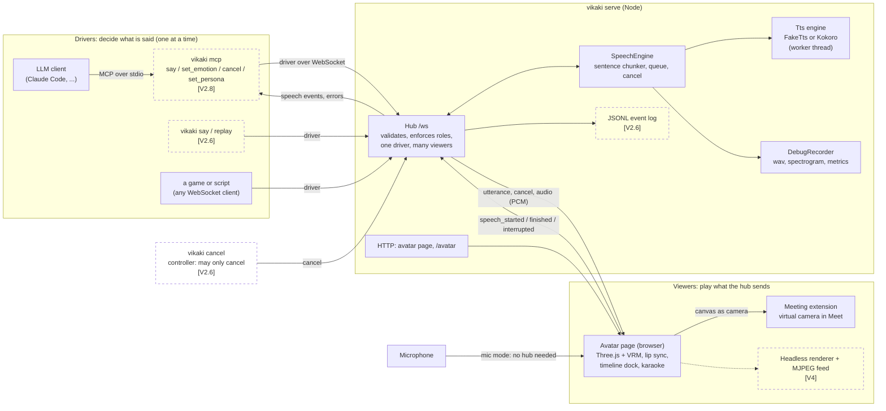
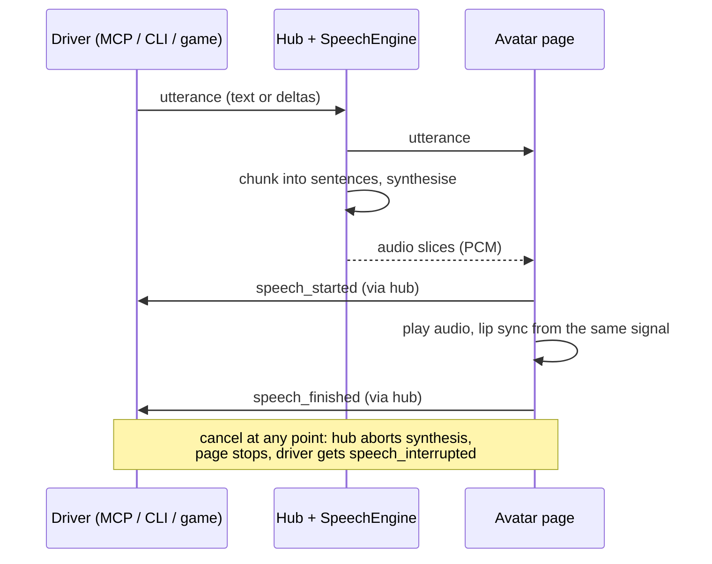

# Architecture

How the pieces fit. Solid boxes exist today; dashed boxes are planned (slice in brackets). Protocol details: [protocol.md](protocol.md). Decisions: [adr/](adr/).

## Where MCP fits

`vikaki mcp` is just another **driver**. An LLM client starts it as a stdio subprocess; it speaks MCP to the client and the ordinary protocol to the hub. Nothing in the hub or the page knows an LLM is involved, so a `say` tool call produces the same event sequence as `vikaki say` (tested in V2.9).

- It connects to a hub that is already running (`vikaki mcp --port 8787`), so the page you are watching is the one it drives.
- It takes the single driver slot on the first tool call. While it holds it, `vikaki say` or a game gets `driver_busy`. `vikaki cancel` still works, because a controller is not a driver.
- `say` returns after the avatar finishes (or is interrupted), with the outcome and time to first audio.
- `set_emotion` and `set_persona` set session defaults that are stamped onto later `utterance` messages. Persona picks the voice now; emotion shows once V3.1 lands.

## One utterance, end to end

With no page connected, the hub plays the speech clock itself and sends the same events, so a driver never waits on a face that is not there.
