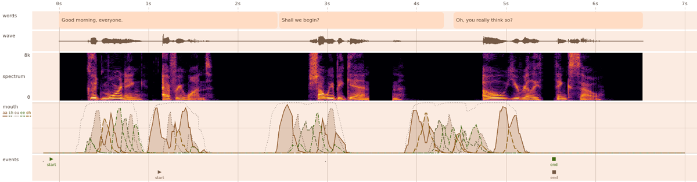

# Observability

How to see what the avatar is doing and saying, without a person listening. Phases are in CLAUDE.md.

## Phase 1: the debug recorder

```bash
pnpm serve --debug-dir .vikaki/debug     # any speech engine; "off" disables it
make demo-speech                         # records by default into .vikaki/debug (git-ignored)
```

Each utterance gets a folder `<time>-<n>-<utterance id>/` with:

| File | What |
| --- | --- |
| `audio.wav` | Exactly what the engine produced, mono 16-bit, at the engine's rate |
| `spectrogram.png` | Time to the right, 0 to 8 kHz up, loud is bright. Ticks every 500 ms (long at each second) and every kHz |
| `metrics.json` | The numbers below, plus `verdict` (`speech`, `buzz` or `silence`) and `reasons` |
| `text.txt` | The text pieces sent to the engine, one per line |
| `timings.json` | Outcome (`completed`, `cancelled`, `failed`), time to first audio, and per piece: when it started, when its audio came, and where that audio sits in the recording (`audioStartSec` to `audioEndSec`) |

Writing never affects speech: a disk error is reported on the console and the driver still gets `speech_finished`. Folder names use a sanitised utterance id, so a driver cannot write outside the directory. Nothing is pruned; delete the folder when you are done.

## Speech or buzz

| Metric | Meaning | Real speech (Kokoro, 3 clips) | Test voice (`FakeTts`) | Cut-off |
| --- | --- | --- | --- | --- |
| `loudnessVariation` | std / mean of frame loudness over the active frames | 0.55 to 0.63 | 0.08 | at least 0.2 |
| `spectralWanderHz` | std of the spectral centroid over the active frames | 1,669 to 2,095 | 2 | at least 300 |

Both must pass: a tone that only wobbles in loudness, or speech flattened to one level, is still a buzz (tests cover both). "Active" is within 30 dB of the clip's 95th-percentile loudness. Pauses are quiet gaps of at least 150 ms between active parts; leading and trailing silence does not count.

The gate lives in `packages/audio/src/metrics.ts` and is tested against a committed real clip (`packages/audio/test/fixtures/`). With the real voice installed, set `VIKAKI_KOKORO_PATH` (see docs/tts.md) and the same test also runs the live engine.

Inspect any file by hand: `pnpm exec tsx scripts/probe-audio.ts some.wav` prints the numbers and writes a spectrogram next to it.

## Phase 2, part 1: the page records its own timeline

The avatar page can remember what it did, on one clock (milliseconds since the page started, from `performance.now()`). It is on in the speech demo and with `?timeline=1`, and reachable as `window.__vikaki.timeline` (`TimelineRecorder`, `packages/engine/src/timeline.ts`):

| What | How |
| --- | --- |
| Every rendered frame: the **commanded** mouth (five weights), the **applied** mouth, loudness, blink | `frames()`; kept for the last 10 minutes at 60 fps |
| Events, stamped on the page clock: `sent`, `cancel`, `started`, `finished`, `interrupted`, `blink`, `error`, and `driver:started` and so on (what the driver was told, to compare with the page) | `events()` |
| Each spoken piece of an utterance (`sentence_index`, `sentence_text` from the hub) with when it was heard, and its audio | `utterance(id)`, `utterances()` |
| All of it as JSON, with audio optional | `toJSON({ fromMs, toMs, includeAudio })` |

**Commanded vs applied.** Commanded is what lip sync asked for. Applied is read back after the avatar updates, from the morph targets behind each mouth shape (`VrmAvatar.appliedVisemes`), so a blend or override that changes the mouth shows up. On the current avatar (Cookieman) the two are equal to within rounding, which is itself useful: it shows nothing is pulling the mouth away. They will differ once emotions with overrides arrive (V3).

**When audio is heard.** Audio is scheduled on the Web Audio clock. `Output.perfMs` converts that to the page clock using the context's output timestamp, which includes the output device's latency; while the browser has not yet allowed sound, the page's own clock is used. An e2e test checks that the `started` event falls within 250 ms of the first piece's scheduled start on a normal machine.

## Phase 2, part 2: the timeline dock

The speech demo has a **Timeline** dock under the avatar. Pick **Live** (the last 8 seconds, with a "now" line) or any spoken line from the list to review it. Lanes, top to bottom, on one time axis:

| Lane | Shows |
| --- | --- |
| words | each spoken piece (sentence) with its text, positioned where it was heard |
| wave | the audio waveform |
| spectrum | the spectrogram, 0 to 8 kHz, so you can see whether it is speech or a buzz |
| mouth | the five commanded mouth shapes as lines (each has its own dash pattern as well as a colour), the displayed mouth as a shaded area, loudness as a dotted line |
| events | the page's own events on the upper row (start, end, cut, blink) and what the driver was told on the lower row (sent, cancel, start, end) |



**Save PNG** and **Save JSON** export what the dock shows (the PNG is drawn at 1600 by 420; the JSON includes the audio when reviewing, so a scorecard can reuse it). Tests and scripts can do the same: `window.__vikaki.timelineUi` has `select(id | "live")`, `exportPng()`, `exportJson()` and `exportLayout()`. `pnpm exec tsx scripts/screenshot-speech.ts <dir> [fake|kokoro]` speaks a line and saves screenshots, live and review, light and dark, plus an export. The colours are Material 3 roles read from the page, so it follows light and dark. For screen readers the dock has a text summary and a table of the sentences in view (`Sentences in this view`); axe checks both.

**What the first real-speech timelines showed**
- Kokoro leaves about 0.7 s of silence between sentences, inside each sentence's audio.
- The page reports `started` as soon as audio plays, but the driver was told 1.45 s later in one run, because the hub's event loop stalled up to 1.8 s while Kokoro synthesised the next sentence (measured with `scripts/probe-hub-lag.ts`). That delays `speech_started` and would delay a `cancel`. Tracked as KAN-1957, not fixed here.
- With the test voice, the mouth takes about 0.7 s to open fully at the start of an utterance, and sags between sentences.

## Phase 2, part 3: karaoke

In the speech demo, **Now speaking** shows the words of the latest line and puts a red dot on the one being said; words already said turn dark. The timeline's words lane draws each word as its own pill, with the same dot on the current one in the live view. A word stays current through a pause until the next begins.

**The word times are estimates, and the page says so.** The voice model gives only a waveform. `estimateWordTimings` (`packages/audio/src/words.ts`) works from the text and the audio of one sentence:
1. Find where there is sound (within 35 dB of the clip's loud end).
2. Share that stretch among the words by syllable count (a rough counter; a comma or full stop adds a pause's worth).
3. Move each boundary to a real pause if one is nearby (the whole quiet stretch is left out of both words); otherwise to the quietest frame, with dips far from the expected place discounted, so a closure inside "Shall" is not taken for its end.

On six real Kokoro clips (46 words) only 2 words had a duration more than 2.5 times or less than 0.4 times their syllable share ("quick" at 55 ms and "if" at 30 ms), against 5 without the distance penalty. That compares against syllable share, not a true alignment, which I do not have. By eye on the timeline the boundaries fall on the bursts of sound.

It sits behind the `WordTimer` type (`(text, samples, rate) => {word, start, end}[]`), and `TimelineRecorder` takes one as an option, so a source that knows the real durations can replace it. The words are exported in the timeline JSON (`pieces[].words`, in timeline milliseconds).

**When the words arrive.** A sentence can only be timed once all of its audio is there, so the hub now sends an empty audio message with `sentence_end: true` right after each sentence's last slice (docs/protocol.md). The page times the sentence then, which is before it is heard. A voice that streams a sentence as it generates it (the test voice in real time) delivers the whole sentence only at its end, so the first words are timed late; Kokoro returns each sentence whole, so it is on time.

**Limits.** The microphone has no audio lane (the recorder only sees speech played from the hub). The spectrogram of a very long utterance is computed in one go on first view, which can pause the page briefly. 

## What this cannot tell you
## What this cannot tell you

It cannot say whether speech sounds good or is the right words, only that it is speech-like. Whether the mouth follows the voice is Phase 3's scorecard.
